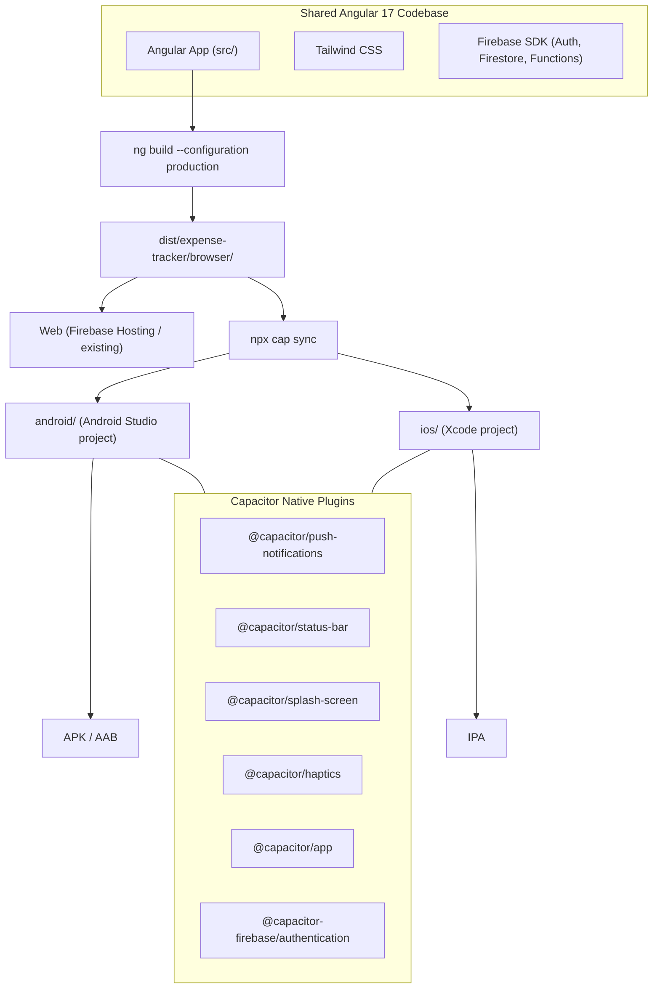

# Capacitor Mobile App for Expense Tracker

## Approach

Use **Capacitor** (by Ionic team) to wrap the existing Angular build output in a native WebView shell. This produces real `.apk` / `.ipa` files publishable to Google Play and App Store with **zero rewrite** of the Angular app. Only targeted changes are needed where the app currently uses browser-only APIs.

## Architecture



## Key Changes Required

### 1. Install Capacitor and initialize native projects

Install `@capacitor/core`, `@capacitor/cli`, and platform packages. Run `npx cap init` to generate `capacitor.config.ts` pointing `webDir` at `dist/expense-tracker/browser`. Then add platforms with `npx cap add android` and `npx cap add ios`.

### 2. Platform detection service

Create a small utility at [`src/app/core/services/platform.service.ts`](src/app/core/services/platform.service.ts) using `Capacitor.isNativePlatform()` to let any service branch between web and native behavior. This replaces direct `window` checks scattered through the code.

### 3. Fix Google Auth (critical)

[`src/app/core/services/auth.service.ts`](src/app/core/services/auth.service.ts) uses `signInWithPopup` (line 51) which **does not work** inside Capacitor's WebView. The fix:

- Install `@capacitor-firebase/authentication` plugin
- On native: use the plugin to trigger native Google Sign-In, get the ID token, then call Firebase `signInWithCredential(auth, GoogleAuthProvider.credential(idToken))` to stay on the same Firebase Auth pipeline
- On web: keep `signInWithPopup` unchanged
- Branch using the platform service

This is the **only substantial code change** -- roughly 15-20 lines in `auth.service.ts`.

### 4. Native push notifications

[`src/app/core/services/notification.service.ts`](src/app/core/services/notification.service.ts) uses the browser `Notification` API (lines 128-176). For native:

- Install `@capacitor/push-notifications`
- On native: register for push, get FCM token, store it in Firestore per user, listen for push events via the Capacitor plugin
- On web: keep existing browser Notification code as-is
- Branch using the platform service

### 5. Conditionally skip PWA service worker on native

[`src/app/app.config.ts`](src/app/app.config.ts) registers `ngsw-worker.js` (line 23). Inside Capacitor, the service worker is unnecessary (assets are already local). Change the `enabled` flag:

```typescript
enabled: !isDevMode() && !Capacitor.isNativePlatform()
```

Similarly, [`src/app/core/services/pwa.service.ts`](src/app/core/services/pwa.service.ts) should early-return on native since `beforeinstallprompt` never fires.

### 6. Status bar and splash screen

Install `@capacitor/status-bar` and `@capacitor/splash-screen`. Configure in `capacitor.config.ts` to match the app's `#2563eb` theme color. Generate splash screen and icons using `@capacitor/assets` CLI tool from the existing `icon.svg`.

### 7. Deep linking and app navigation

Install `@capacitor/app` to handle the hardware back button on Android and app URL open events. Wire it into Angular's router in `app.component.ts`.

### 8. Build scripts

Add npm scripts to [package.json](package.json):

- `"build:mobile"` -- `ng build --configuration production && npx cap sync`
- `"open:android"` -- `npx cap open android`
- `"open:ios"` -- `npx cap open ios`

### 9. Native project configuration

- **Android**: Update `android/app/google-services.json` with the Firebase project config (download from Firebase Console after registering the Android app with package name)
- **iOS**: Update `ios/App/App/GoogleService-Info.plist` similarly
- Configure URL scheme for Google Sign-In redirect in both native projects

### 10. .gitignore updates

Add `android/` and `ios/` platform folders to `.gitignore` (or commit them -- Capacitor recommends committing). Also ignore `android/app/build/` and `ios/App/Pods/`.

## What stays unchanged

- All Angular components, routes, templates, and Tailwind styles
- Firestore data layer and all business logic
- The budget, transaction, category, analysis, AI, trends, and profile features
- The entire `functions/` Cloud Functions backend
- The web deployment path

## Prerequisites

- **Android Studio** installed (for Android builds)
- **Xcode** installed on a Mac (for iOS builds)
- Register Android/iOS apps in the Firebase Console to get `google-services.json` / `GoogleService-Info.plist`
- A Google Cloud OAuth client ID for Android and iOS (for native Google Sign-In)
